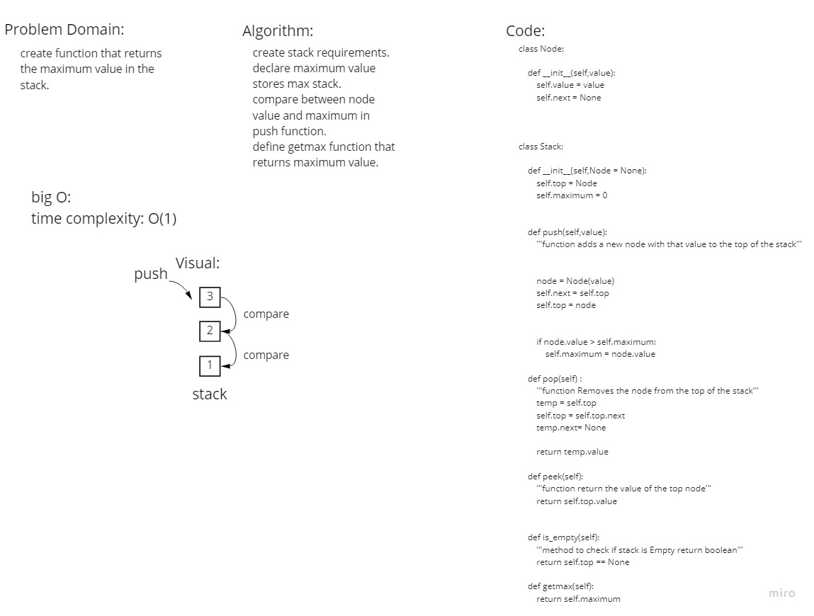

# Max Stack
<!-- Description of the challenge -->
create function that returns
the maximum value in the stack.

## Whiteboard Process
<!-- Embedded whiteboard image -->

## Approach & Efficiency
<!-- What approach did you take? Why? What is the Big O space/time for this approach? -->
time complexity : O(1)
space complexity: O(1)

## Solution
<!-- Show how to run your code, and examples of it in action -->