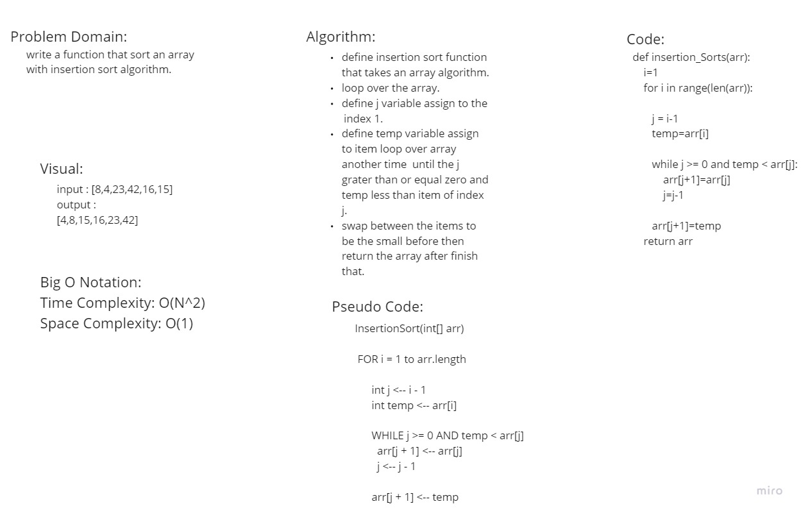

# Insertion Sort
<!-- Description of the challenge -->

## Whiteboard Process
<!-- Embedded whiteboard image -->

## Approach & Efficiency
<!-- What approach did you take? Why? What is the Big O space/time for this approach? -->
### Time: O(n^2)

The basic operation of this algorithm is comparison. This will happen n * (n-1) number of times…concluding the algorithm to be n squared.

### Space: O(1)

No additional space is being created. This array is being sorted in place…keeping the space at constant O(1).

## Solution
<!-- Show how to run your code, and examples of it in action -->
[blog](./blog.md)