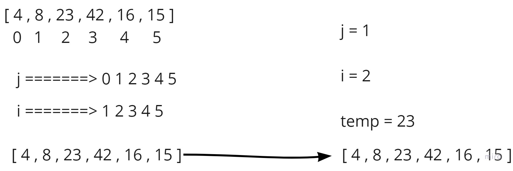
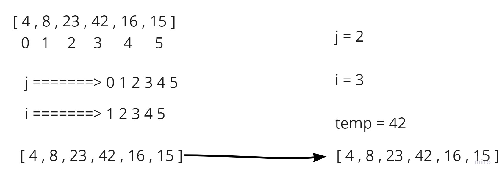
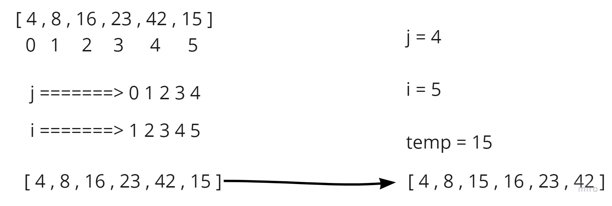

# Insertion Sort
insertion Sort is a sorting algorithm that traverses the array multiple times as it slowly builds out the sorting sequence. The traversal keeps track of variable (temp) value and compare its value with the next item in the array if the temp was smaller than the next value it will swap them then moves to the next values .

the array has 2 counters i and j the j keeps track of the current value the i keeps track of the next value store it in temp variable

if the current value is bigger than the previous value then it will swap these values it will keep doing this untill you reach value which is bigger than previous

 InsertionSort(int[] arr)

    FOR i = 1 to arr.length

      int j <-- i - 1
      int temp <-- arr[i]

      WHILE j >= 0 AND temp < arr[j]
        arr[j + 1] <-- arr[j]
        j <-- j - 1

      arr[j + 1] <-- temp

# Trace
Sample Array: [8,4,23,42,16,15]

**Pass 1:**

first we compare the array elemnt at index 1 (temp) with the previous elemnt arr[j] if the temp is smaller than the preivous then we swap the values so that temp will turn from 4 to 8.

**Pass 2:**

now temp is equal to 23 because i = 2 so we compare temp with previous value (value at index j) which is 8 and scince the 23 is bigger than 8 it will not swap.

**Pass 3:**

now temp is equal to 42 because i = 3 so we compare temp with previous value (value at index j) which is 23 and scince the 42 is bigger than 23 it will not swap.

**Pass 4:**

now temp is equal to 16 because i = 4 so we compare temp with previous value (value at index j) which is 42 and scince the 42 is bigger than 16 it will swap and then check with previous values and stops when 16 is bigger than its previous value.

**Pass 5:**

now temp is equal to 15 because i = 5 so we compare temp with previous value (value at index j) which is 42 and scince the 42 is bigger than 15 it will swap and then check with previous values and stops when 15 is bigger than its previous value.

# Efficency:
### Time Complexity: O(n^2)

### Space Complexity: O(1)

