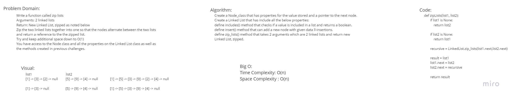

# linked-list-zip
<!-- Description of the challenge -->
Write a function called zip lists
Arguments: 2 linked lists
Return: New Linked List, zipped as noted below
Zip the two linked lists together into one so that the nodes alternate between the two lists and return a reference to the the zipped list.
Try and keep additional space down to O(1)
You have access to the Node class and all the properties on the Linked List class as well as the methods created in previous challenges.

## Whiteboard Process
<!-- Embedded whiteboard image -->

## Approach & Efficiency
<!-- What approach did you take? Why? What is the Big O space/time for this approach? -->
Time Complexity: O(n)
Space Complexity : O(n)

## Solution API
<!-- Show how to run your code, and examples of it in action -->
Create a Node_class that has properties for the value stored and a pointer to the next node.
Create a Linked List that has include all the below properties:
define includes() method that checks if a value is included in a list and returns a boolean.
define insert() method that can add a new node with given data ll-insertions.
define zip_lists() method that takes 2 arguments which are 2 linked lists and return new Linked List, zipped.
