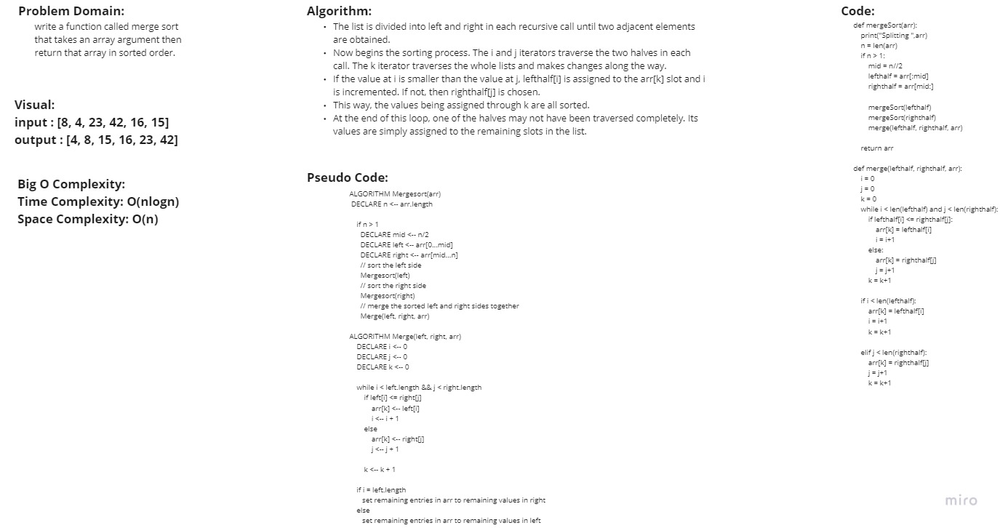

# Merge Sort
<!-- Description of the challenge -->

## Whiteboard Process
<!-- Embedded whiteboard image -->

## Approach & Efficiency
<!-- What approach did you take? Why? What is the Big O space/time for this approach? -->
Time Complexity: O(n log n)
Space Complexity : O(n)

## Solution
<!-- Show how to run your code, and examples of it in action -->
[Merge](./merge_sort/merge.py)