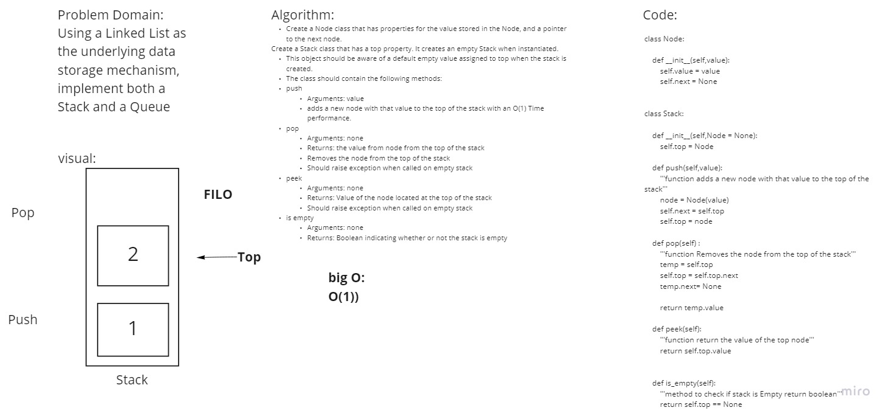
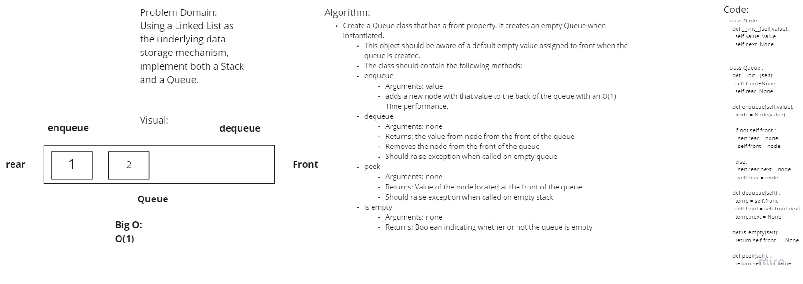

# Stacks and Queues
<!-- Short summary or background information -->
A stack is a data structure that consists of Nodes. Each Node references the next Node in the stack, but does not reference its previous.
Common terminology for a queue is

Enqueue - Nodes or items that are added to the queue.
Dequeue - Nodes or items that are removed from the queue. If called when the queue is empty an exception will be raised.
Front - This is the front/first Node of the queue.
Rear - This is the rear/last Node of the queue.
Peek - When you peek you will view the value of the front Node in the queue. If called when the queue is empty an exception will be raised.
IsEmpty - returns true when queue is empty otherwise returns false

## Whiteboard Process
<!-- Embedded whiteboard image -->

## Challenge
<!-- Description of the challenge -->
Using a Linked List as the underlying data storage mechanism, implement both a Stack and a Queue

## Approach & Efficiency
<!-- What approach did you take? Why? What is the Big O space/time for this approach? -->

## API
<!-- Description of each method publicly available to your Stack and Queue-->