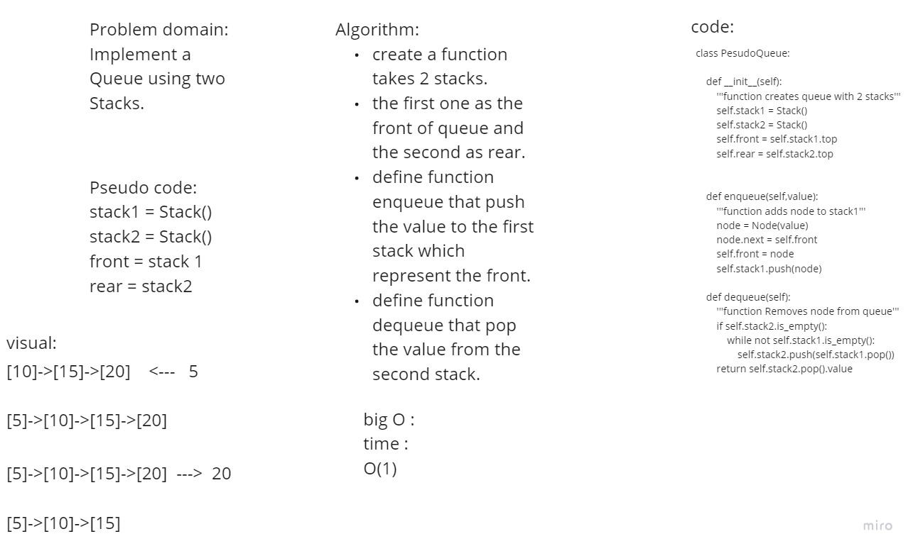

# Challenge Summary
<!-- Description of the challenge -->
Create a new class called pseudo queue.
Do not use an existing Queue.
Instead, this PseudoQueue class will implement our standard queue interface (the two methods listed below)
Internally, utilize 2 Stack instances to create and manage the queue

## Whiteboard Process
<!-- Embedded whiteboard image -->

## Approach & Efficiency
<!-- What approach did you take? Why? What is the Big O space/time for this approach? -->
time complexity : O(1)
space complexity: O(1)

## Solution
<!-- Show how to run your code, and examples of it in action -->